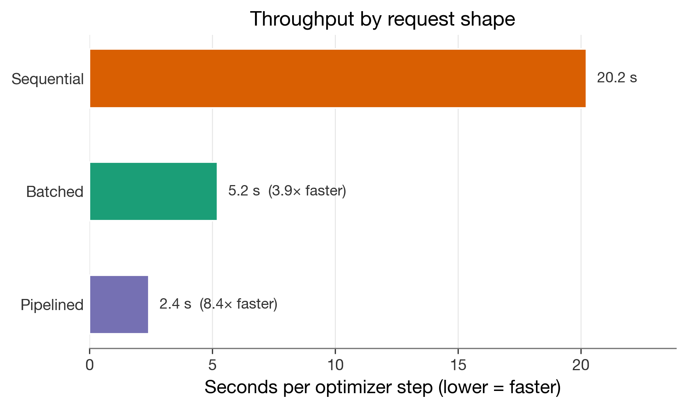
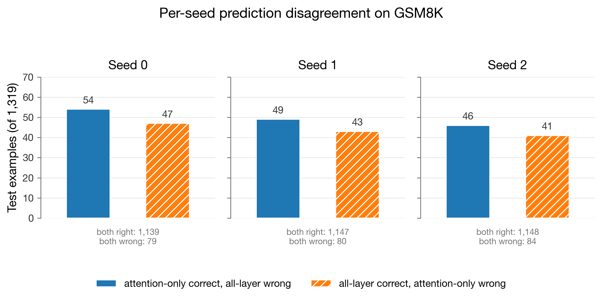

This is the worklog version of the [LoRA and Friends](/research/lora-and-friends) experiment.

The final public artifacts are:

- model checkpoints: [sumitdotml/lora-and-friends](https://huggingface.co/sumitdotml/lora-and-friends)
- dataset: [sumitdotml/lora-and-friends-dataset](https://huggingface.co/datasets/sumitdotml/lora-and-friends-dataset)

## 1. Before The Run

### 2026-04-19: the first plan had too many moving parts

I started with too many possible experiments in the air: full fine-tuning, MoE, RL, transfer evaluation, Tinker defaults, LoRA target modules, dataset choice, benchmark choice, and budget. That was not a runnable project but a pile of directions.

I removed most of it. Phase one became:

- one model: `Qwen3-8B`
- one task family: math reasoning
- one final benchmark anchor: `GSM8K`
- one supervised fine-tuning comparison: attention-only LoRA vs all-layer LoRA

I kept `Qwen3-8B` as the working model. `Qwen3-8B-Base` stayed in reserve for a different post-training story, and a smaller future model would have added a model-choice variable that I did not want in the first comparison.

The target-module comparison was the part I wanted to isolate:

| condition        | intended adapter scope        |
| ---------------- | ----------------------------- |
| `attention_only` | attention projections         |
| `all_layer`      | attention and MLP projections |

That meant everything else had to become boring on purpose: same base model, same data, same rank, same training schedule, same evaluation prompt, same answer extraction, same benchmark, and same checkpoint-selection rule.

### Why GSM8K became the benchmark, not the main training set

`GSM8K` was tempting as a training source because it is clean and familiar. But the train split has only `7,473` rows, and the test split has `1,319` rows. I wanted the final score to be held out and easy to explain, so I kept GSM8K as the benchmark anchor.

The training source moved to `nvidia/OpenMathInstruct-2`, especially the `train_1M` split. The schema was simple enough to render into chat format:

```json
{
	"problem": "Solve for $y$:\n\n$$\\frac{y^2 - 3y + 2}{y - 2} = y + 1$$",
	"generated_solution": "... \\[ y = \\boxed{2} \\]",
	"expected_answer": "2",
	"problem_source": "augmented_math"
}
```

I also looked at `unsloth/OpenMathReasoning-mini`. It had more character and much longer traces, but the token profile made it harder to fit into the budget. `OpenMathInstruct-2` looked less exciting, but it had the right shape for a controlled SFT comparison.

The first sizing pass made the budget concrete. A 500-row tokenizer sample from OpenMathInstruct-2 averaged `456.9` rendered tokens per example, with `p90 = 813` and `p95 = 963`. At Tinker's then-current `Qwen3-8B` training price of `$0.40 / M` tokens, a 30k-example run started to look feasible.

The first target was a mildly balanced 30k dataset:

```text
30k working raw dataset
- 21,000  augmented_math
-  7,000  augmented_gsm8k
-  1,000  math
-  1,000  gsm8k
```

The first plan did not survive.

### The first run sheet was useful even though it was wrong

The first run sheet had a training split of `27,000` rows and a validation split of `3,000` rows. With the early weighted mean estimate, that came out to about `11.70M` train tokens per epoch and about `$4.68` per epoch.

The pilot shape was also already there:

```text
pilot sweep
- train rows: 5,000
- val rows:     500
- 2 conditions x 3 LR values x 1 seed x 1 epoch
```

And the main comparison shape was visible:

```text
thesis comparison
- 2 conditions x 3 seeds x 2 epochs
- total train cost: about $56.17
```

Those numbers were later superseded, but they were still useful. They forced me to think in runs, seeds, rows, tokens, and dollars instead of treating "fine-tune a model" as one vague action.

The benchmark side looked cheap in comparison. One full GSM8K eval was estimated around cents, not dollars of training cost. So from the beginning, training data and training schedule were the real budget levers.

## 2. Before Training

### 2026-04-20: the first dataset looked usable until I read it

The initial `openmath_30k` artifacts matched the recipe exactly: `27,000` train rows and `3,000` validation rows. Structurally it looked clean. Every inspected training row had a final `\boxed{...}` answer. The first rendered dataset under `qwen3_disable_thinking` also looked reasonable.

Then the manual audit started doing its job.

One sampled `augmented_gsm8k` row reasoned itself into clipping a percentage answer to `100` because a fictional budget was too small. A tetrahedron row noticed a fractional tetrahedron count was impossible and still pushed through to a final ratio. A pattern search found disclaimer-like repair language:

```text
cannot spend more than she has
doesn't align with the logical outcome
we need to set the value to 100
```

At first I treated this as a light cleanup problem. I removed a couple of flagged rows, built filtered artifacts, and added manual review packs. The mismatch count fell, the obvious bad rows got smaller, and the dataset felt closer.

But each pass exposed another class of issue.

### The augmented branch kept asking for another pass

The suspicious rows were concentrated in the augmented sources. The failures were not all the same, but they had a family resemblance: impossible integer counts, prompt-generation residue, unsupported case-bashing, and answers that looked right only because the generated reasoning had quietly changed the problem.

The review packs were small enough to inspect but large enough to change my mind. A `53`-row suspicious train pack for `curated_v2` produced `29` removals. A later `61`-row suspicious train pack produced `30` hard removals, all from `augmented_math`. These were not tiny formatting mismatches but rows with broken reasoning, contaminated prompts, or invalid proofs.

The curation sequence became longer than I wanted:

- `curated_v2`: after the first train and validation suspicious-row removals
- `curated_v3`: after another suspicious train review
- `curated_v4`: after validation cleanup
- `curated_v5`: after backfilling weak `augmented_math` rows
- `curated_v6`: after removing prompt-generation debris like `A new problem:` and `The new problem is:`

One excerpt from the log captures the real issue:

```text
The problem was no longer "find one more regex,"
it was "stop trusting augmented_math as the backbone of the dataset."
```

At that point I stopped trying to rescue the 30k augmented-heavy recipe. If the dataset takes repeated repair passes and still produces obvious bad rows in random review, then it stops being a clean experimental input and becomes the experiment itself.

I did not want the final write-up to be "attention-only LoRA versus all-layer LoRA, but also maybe the augmented data had hidden garbage." That would have made every downstream result harder to trust.

### 2026-04-20 to 2026-04-21: I rebuilt around original rows only

`OpenMathInstruct-2 train_1M` had `29,468` original-source rows across `gsm8k` and `math`. After the strict gate, `28,166` survived cleanly enough to build a new candidate.

The accepted source counts were:

```json
{
	"gsm8k": 14618,
	"math": 13548
}
```

The original-only dataset was smaller than the 30k target, but the quality profile was much better. It cleared the automatic checks that the augmented branch kept failing:

- boxed-match rate, train: `1.0`
- boxed-match rate, validation: `1.0`
- suspicious rows, train: `0`
- suspicious rows, validation: `0`
- prompt-wrapper contamination hits, train: `0`
- prompt-wrapper contamination hits, validation: `0`

I froze this path as `openmath_original_clean`.

After a later split repair, the final retained manifest became:

| split      | `gsm8k` source rows | `math` source rows |  total |
| ---------- | ------------------: | -----------------: | -----: |
| train      |              13,145 |             12,203 | 25,348 |
| validation |               1,473 |              1,345 |  2,818 |

The old `openmath_30k*` lineage was retired after that. I wanted one clear dataset path in the repo, not a dozen stale artifact branches that future-me or another agent might accidentally treat as active.

### 2026-04-21: I kept the system prompt

The render sanity check compared the frozen dataset with and without the system prompt under the actual `Qwen/Qwen3-8B` chat template. The prompt added a constant `27` tokens per example.

```json
{
	"full_mean_with_system": 340.25,
	"full_mean_without_system": 313.25,
	"full_mean_delta": 27.0
}
```

That overhead was small enough to keep. More importantly, the prompt made the output contract explicit:

```text
You are a careful math solver. Solve the problem step by step. Put the final answer in \boxed{}.
```

I kept it because the raw problems themselves do not always carry the boxed-answer instruction. I also wanted training and evaluation to mirror each other as closely as possible.

## 3. Contracts And Sanity Checks

### 2026-04-22: I stopped relying on memory

Once the dataset path was stable, the next risk was format drift. It is easy to train with one prompt, evaluate with another, parse answers a third way, and then accidentally report a prompt experiment as a model experiment.

So I wrote the contracts down before the final result existed.

I also had to clean up the planning docs. Some TODO labels were too compressed. A label like "contamination check" made sense to me while I was in the middle of the work, but it hid the actual operation: compare training-side `gsm8k` problem text against held-out GSM8K test questions after canonical normalization, then block training if overlap is greater than zero.

So I added an execution-clarity rule for the project: open tasks needed to say what the action was, why it mattered, what counted as done, and what happened if it failed. It sounds procedural, but it kept the later runbook from turning into shorthand only I could decode.

The evaluation contract froze:

- the same system prompt as training
- greedy decoding with `temperature = 0`
- `enable_thinking=False`
- `max_new_tokens = 512`
- no custom stop tokens
- boxed-answer extraction only
- exact match after normalization
- the contamination report path

The contamination check was a gate, not a note. If training-side `gsm8k` rows overlapped the GSM8K test questions, the benchmark had to change or the dataset had to be rebuilt.

The result schema was frozen around retained JSONL output under `artifacts/results/<run_id>/`. It also kept `token_count` and `cost` in the canonical schema even when those values were `null`, because I did not want the schema to change later just because telemetry became available.

I also standardized on the word `condition` for the comparison label, which sounds minor but made later artifacts easier to read:

```json
{
	"condition": "attention_only",
	"seed": 0,
	"step": 3169
}
```

### 2026-05-03: the dataset split still had a hidden problem

When I ran the dataset-integrity gate, the benchmark side passed. The training-side `gsm8k` rows had `0` overlap with the `openai/gsm8k` test split.

But the local train/validation split failed a different check. OpenMath can include multiple accepted solutions for the same underlying problem. The original builder had split rows independently, so variants of the same problem could land on both sides.

That would make validation loss too friendly. It would also make checkpoint or LR decisions look cleaner than they were.

The fix was to group by canonical problem text before splitting. The retained report after the rebuild says:

```json
{
	"status": "pass",
	"overlap_count": 0,
	"train_val_overlap": {
		"row_id_overlap_count": 0,
		"problem_text_overlap_count": 0,
		"overlapped_val_row_count": 0
	}
}
```

The final contamination report compared `13,145` training rows with `source == "gsm8k"` against `1,319` GSM8K test questions. It found `overlap_count = 0`.

The raw files were not enough on their own, and the split rule mattered.

### 2026-05-04: the dataset went to Hugging Face

After the repaired split, the frozen dataset payloads were published to `sumitdotml/lora-and-friends-dataset`.

The local repo kept scripts, manifests, checksums, and audit evidence. The Hub repo carried the payloads:

| payload             |   rows |      bytes |
| ------------------- | -----: | ---------: |
| raw train           | 25,348 | 25,528,287 |
| raw validation      |  2,818 |  2,787,397 |
| rendered train      | 25,348 | 29,989,535 |
| rendered validation |  2,818 |  3,283,365 |

At this point I had a real dataset, a render path, an evaluation contract, and a contamination gate. I still did not know whether the training path would work.

## 4. First Tinker Check

### 2026-05-04: the first backend check caught a renderer trap

The first Tinker smoke pass was supposed to be boring. It was one of the smallest checks in the whole project: can Tinker accept `Qwen/Qwen3-8B`, rank `8`, and the two LoRA condition switches?

The Tinker cookbook `qwen3_disable_thinking` renderer was correct for generation prompts, but its supervised-training path did not match the frozen SFT render contract. The project contract was the Hugging Face chat template with `enable_thinking=False`, which renders an empty thinking block before the assistant answer:

```text
<think>

</think>
```

I changed the smoke runner so Tinker datums came from `AutoTokenizer.apply_chat_template(..., enable_thinking=False)`, then masked loss only after the rendered prompt prefix.

The retained smoke pass then gave me enough to lock the adapter defaults:

| condition        | train rows in smoke | optimizer steps |     validation NLL |
| ---------------- | ------------------: | --------------: | -----------------: |
| `attention_only` |                   1 |               1 | 1.5048651695251465 |
| `all_layer`      |                   8 |               1 | 1.4733978509902954 |

Tinker accepted:

```json
{
	"attention_only": {
		"train_attn": true,
		"train_mlp": false,
		"train_unembed": false
	},
	"all_layer": {
		"train_attn": true,
		"train_mlp": true,
		"train_unembed": false
	}
}
```

The public Tinker API did not expose local `lora_alpha` or `lora_dropout` fields through this training path. I recorded those as backend-owned instead of pretending the runner controlled them.

There was one more small backend detail in the log: the first smoke attempt printed that the Tinker SDK version was outdated. I upgraded to `tinker==0.18.2`, reran the smoke pass, and the warning did not reappear. Backend version drift becomes hard to reconstruct later, so I kept the note.

The smoke pass also created checkpoint paths with a seven-day TTL. That did not matter for the final result yet, but it foreshadowed the export urgency after the main sweep.

### 2026-05-05: I ran the untouched baseline before touching LoRA

The baseline was `Qwen/Qwen3-8B` on `openai/gsm8k`, config `main`, split `test`, with `enable_thinking=false`, `temperature=0`, and `max_new_tokens=512`.

The retained baseline run was:

```text
artifacts/results/baseline-qwen3-8b-gsm8k-001/
```

It scored:

- examples: `1,319`
- correct: `1,115`
- accuracy: `0.8453373768006065`
- extraction failures: `31`
- total eval tokens: `505,694`

I wanted this number before LR selection and before the main comparison. Otherwise, the final LoRA scores would float without a reference.

## 5. Learning Rate And Batch Shape

### 2026-05-06: the LR-selection plan was too slow

The first LR-selection protocol used `5,000` train rows and `500` validation rows. On paper it was reasonable. In practice it projected to roughly `20` hours for the six-run sweep on Tinker.

I rescaled it to a deterministic slice:

- first `512` train rows
- first `128` validation rows
- seed `7`
- LR grid: `1e-4`, `3e-4`, `1e-3`
- two conditions
- one epoch
- effective batch size `8`

The narrow purpose was to choose a peak LR per condition, not to run a final benchmark or a condition comparison.

The selected LR was `3e-4` for both:

| condition        |     LR | best validation NLL |
| ---------------- | -----: | ------------------: |
| `attention_only` | `1e-4` |  0.3786645046540731 |
| `attention_only` | `3e-4` |  0.3632619345728878 |
| `attention_only` | `1e-3` |  0.3644437038722405 |
| `all_layer`      | `1e-4` |  0.3648794147648033 |
| `all_layer`      | `3e-4` |  0.3559855057286731 |
| `all_layer`      | `1e-3` | 0.37397296784836664 |

I kept seed `7` reserved for selection work so the main comparison seeds could be `0`, `1`, and `2`.

The LR-selection runner also caught a plain implementation bug before the expensive runs. I had assumed Tinker cookbook datum weights were raw torch tensors. They were `TensorData` objects. The live one-step probe failed, the runner got fixed, and that mistake went into `AGENT_MISTAKES.md`. The final result depends on the boring part where a runner can survive a one-step live probe before it is trusted for a sweep.

I also split the training helper code into smaller modules:

- `training/common.py`
- `training/sft.py`
- `training/lora.py`

The runnable scripts stayed separate: one for the smoke pass, one for LR selection, and later one for the main training sweep. This kept the orchestration scripts readable enough that I could still inspect what was being frozen.

### 2026-05-07: speed was tempting, but batch size was not free

The initial runner shape used eight one-datum train requests before each optimizer step. A throughput probe showed that request shape mattered a lot at the same effective batch size:



| request shape              | seconds per optimizer step |
| -------------------------- | -------------------------: |
| `single_datum_calls`       |          20.22187466151081 |
| `batched_datums`           |          5.201307859155349 |
| `batched_datums_pipelined` |         2.4104866901249693 |

The fast version, `batched_datums_pipelined`, submits one batched `forward_backward_async(...)` request and queues the optimizer request before waiting. That kept the nominal effective batch size at `8`; it only changed how the same batch was sent to Tinker.

Then larger batches looked tempting. Batch `512` and `1024` were much faster in throughput probes. But batch size is a real hyperparameter for LoRA, so I made the larger-batch path earn its way in by validation NLL, and it did not.

| condition        | selected batch/LR |       selected NLL | best larger-batch candidate |       candidate NLL |
| ---------------- | ----------------- | -----------------: | --------------------------- | ------------------: |
| `attention_only` | batch 8, `3e-4`   | 0.3632619345728878 | batch 512, `1e-3`           | 0.37616809419132946 |
| `all_layer`      | batch 8, `3e-4`   | 0.3559855057286731 | batch 512, `1e-3`           |  0.3569802998485914 |

So the main run kept effective batch size `8`, used the pipelined request shape, and kept the final partial batch of `4` rows rather than wrapping around and duplicating examples. The fast path was real, but it was only allowed to change operations, not silently change the scientific comparison.

## 6. The Six Runs

### 2026-05-08: `main-001` started

The main run expanded to six sequential condition/seed runs:

- `main-001-attention_only-seed-0`
- `main-001-attention_only-seed-1`
- `main-001-attention_only-seed-2`
- `main-001-all_layer-seed-0`
- `main-001-all_layer-seed-1`
- `main-001-all_layer-seed-2`

The launch command was:

```text
uv run training/run_main_training.py --run-prefix main-001
```

Each run used:

- train rows: `25,348`
- validation rows: `2,818`
- epochs: `2`
- effective batch size: `8`
- optimizer steps per epoch: `3,169`
- total optimizer steps: `6,338`
- warmup steps: `190`
- peak LR: `3e-4`
- min LR: `3e-5`

The validation/checkpoint cadence was `1000`, `2000`, `3169`, `4000`, `5000`, `6000`, and `6338`.

I monitored this like a long-running job, because it was one. The raw log has many repeated entries that look boring at first glance:

```text
validation step=1000 nll=...
validation step=2000 nll=...
validation step=3169 nll=...
...
```

Those entries showed that the run was still alive, that validation/checkpoint blocks resumed correctly, and that every retained checkpoint path was read from the active run rather than guessed from a sibling run.

I had already made that mistake once while logging a checkpoint URL by analogy from a sibling run. The fix was simple: read the exact checkpoint string from the active run's `metrics.jsonl` or summary before writing it down. After that, I treated checkpoint paths as evidence, not as strings I could reconstruct from memory.

### Step 3169 kept showing up

The first attention-only seed hit:

```text
main-001-attention_only-seed-0: validation step=3169 nll=0.336164
```

Its final summary selected step `3169`, not the final step `6338`:

```text
selected best validation step: 3169
selected validation_mean_nll: 0.33616363178874076
```

Then seed `1` selected step `3169`, then seed `2`, then all-layer seed `0`, then all-layer seed `1`, then all-layer seed `2`.

At the end, every run selected the one-epoch boundary:

| run                              | selected step |      validation NLL |
| -------------------------------- | ------------: | ------------------: |
| `main-001-attention_only-seed-0` |          3169 | 0.33616363178874076 |
| `main-001-attention_only-seed-1` |          3169 | 0.33621202263413363 |
| `main-001-attention_only-seed-2` |          3169 | 0.33651007850933906 |
| `main-001-all_layer-seed-0`      |          3169 | 0.33611938013674597 |
| `main-001-all_layer-seed-1`      |          3169 | 0.33655583715915666 |
| `main-001-all_layer-seed-2`      |          3169 | 0.33634131648081267 |


The selected NLL means were close:

- `attention_only`: `0.3362952443107378`
- `all_layer`: `0.3363388445922384`

But the post-3169 behavior was different. Attention-only stayed near the selected NLL. All-layer jumped more sharply after the one-epoch boundary; at step `4000`, all-layer mean NLL was `0.3457733619534809`.

I did not treat that as the final result though; it was a training diagnostic, and the actual comparison still had to come from GSM8K.

For all-layer seed `1`, the NLL moved from `0.33655583715915666` at step `3169` to `0.34549824556309505` at step `4000`. For all-layer seed `2`, it moved from `0.33634131648081267` to `0.3461580484910246`.

The lowest-NLL checkpoint rule prevented later checkpoints from becoming attractive simply because they were later or because the run had continued longer.

### The sweep finished with six pass summaries

The final all-layer seed completed on 2026-05-09. The log entry was satisfying because the sweep had finally become a finite object:

```text
completion artifacts now exist in artifacts/results/main-001-all_layer-seed-2/:
manifest.json, metrics.jsonl, sample_render.txt, summary.json
```

Each of the six selected checkpoints had a seven-day Tinker TTL, so the next step was urgent enough: export the selected checkpoint states into something that could be evaluated and published.

## 7. Checkpoint Export

### 2026-05-09: training weights were not sampler weights

The selected training checkpoints used `weights/...` paths. I initially wanted to use those directly for publication/evaluation, but the sampling client rejected that shape.

The actual server response was:

```text
tinker.BadRequestError: Error code: 400 - {'detail': 'model_path must point to a sampler_weights checkpoint, got weights'}
```

So the selected training state checkpoints had to be converted to sampler-format weights before any evaluation could run.

The working export path was:

```text
load_state_async(training_checkpoint_path)
save_weights_for_sampler_async(export_name)
```

The six sampler checkpoint URIs then looked like:

```text
tinker://.../sampler_weights/export-main-001-attention_only-seed-0-step-3169
tinker://.../sampler_weights/export-main-001-all_layer-seed-2-step-3169
```

After that, the converted adapters were uploaded to the Hugging Face model repo. The published layout is:

```text
checkpoints/best-checkpoints/attention_only/seed-{0,1,2}/step-3169/
checkpoints/best-checkpoints/all_layer/seed-{0,1,2}/step-3169/
```

The sampler weights also made the adapter-size difference concrete. The attention-only sampler exports were about `30.8M` bytes each in the Tinker checkpoint listing, while the all-layer sampler exports were about `87.5M` bytes each. That was expected from the larger adapter scope, but it was useful to see it in the retained checkpoint metadata rather than only as intuition.

## 8. GSM8K Evaluation

### 2026-05-10: the evaluation runner needed checkpoint awareness

The baseline path already existed, but checkpoint evaluation needed more safeguards. I added support for:

- `--checkpoint-path`
- explicit `--seed`
- explicit `--condition`
- a run-id slug that would not collide when checkpoint paths ended similarly
- step parsing only from literal `step-<digits>` tokens

I also made the argument validation fail fast if a checkpoint path was passed without condition or seed. I did not want a LoRA checkpoint quietly defaulting to `base`.

Before launching the full sweep, I ran a one-example probe with `attention_only` seed `0`. It returned `1/1` correct and confirmed the full path:

```text
sampler URI -> tokenizer -> Tinker sample -> boxed-answer extraction -> scoring -> retained artifacts
```

### The six eval runs

The full sweep ran at `--concurrency 16`, no limit, against the six selected sampler checkpoints.

The baseline stayed:

- accuracy: `0.8453373768006065`
- correct: `1115/1319`
- extraction failures: `31`

The six LoRA eval runs were:

| condition        | seed |           accuracy | correct / total | extraction failures |
| ---------------- | ---: | -----------------: | --------------: | ------------------: |
| `attention_only` |    0 | 0.9044730856709629 |     1193 / 1319 |                   6 |
| `attention_only` |    1 | 0.9067475360121304 |     1196 / 1319 |                   2 |
| `attention_only` |    2 | 0.9052312357846853 |     1194 / 1319 |                   5 |
| `all_layer`      |    0 | 0.8991660348749052 |     1186 / 1319 |                   5 |
| `all_layer`      |    1 | 0.9021986353297953 |     1190 / 1319 |                   4 |
| `all_layer`      |    2 | 0.9014404852160728 |     1189 / 1319 |                   8 |

Aggregated by condition:

| condition        |      mean accuracy |                min |                max |              range |
| ---------------- | -----------------: | -----------------: | -----------------: | -----------------: |
| `attention_only` | 0.9054839524892596 | 0.9044730856709629 | 0.9067475360121304 | 0.0022744503411676 |
| `all_layer`      | 0.9009350518069245 | 0.8991660348749052 | 0.9021986353297953 | 0.0030326004548901 |


The mean gap was `0.0045489006823352`, or about `0.455` percentage points, in favor of attention-only. Under the frozen rule, that is below the `0.01` threshold for a winner claim. So the honest reading is local: attention-only ended higher in this run set and used a smaller adapter, but the result stays inside the pre-declared inconclusive band.

### The disagreement view made the result easier to read

The net accuracy chart showed the final result, but the disagreement chart explained its shape better.



For paired seeds:

| seed | attention-only only | all-layer only | both correct | both wrong | delta |
| ---: | ------------------: | -------------: | -----------: | ---------: | ----: |
|    0 |                  54 |             47 |         1139 |         79 |    +7 |
|    1 |                  49 |             43 |         1147 |         80 |    +6 |
|    2 |                  46 |             41 |         1148 |         84 |    +5 |

The two conditions mostly agree, with the difference coming from a narrow band of examples where attention-only is correct slightly more often than the reverse.

## 9. Figures And Cleanup

### 2026-05-10: the figure pass changed how I told the result

The figure pipeline produced eight retained artifacts. This worklog uses four of them:

- `fig_03`: GSM8K accuracy by condition
- `fig_04`: per-seed prediction disagreement
- `fig_05`: validation NLL by training step
- `fig_08`: throughput by request shape

The figure pass forced me to separate claims that were getting blurred together:

- validation NLL explains checkpoint selection
- GSM8K accuracy explains benchmark performance
- prediction disagreement explains the narrow accuracy gap
- throughput explains an operational runner choice

The fig_04 design took the most iteration. The original idea was a slope/delta view showing net correct-count deltas of `+7`, `+6`, and `+5`. It kept reading like a progression over time or a tiny effect exaggerated by the axis.

The raw log records several rejected forms: vertical slope, leader labels, corner text boxes, horizontal dumbbell, vertical paired columns, and delta-only bars. The recurring problem was that the visual form was louder than the claim. A `0.4` to `0.5` percentage-point gap should not be drawn like a dramatic swing.

The final chart became per-seed disagreement small multiples. That matched the actual question better: where do the two conditions disagree?

The log records the final contingency numbers before implementation:

```text
seed 0: attention_only_only=54, all_layer_only=47, both_correct=1139, both_wrong=79
seed 1: attention_only_only=49, all_layer_only=43, both_correct=1147, both_wrong=80
seed 2: attention_only_only=46, all_layer_only=41, both_correct=1148, both_wrong=84
```

I kept the filename as `fig_04_paired_seed_slope` so existing artifact paths did not move, but the chart itself became the disagreement view.

### The cleanup rule

The result can say:

- both LoRA conditions improved over the untouched baseline on GSM8K
- attention-only had the higher three-seed mean in this retained run set
- attention-only had a small paired-seed disagreement edge
- the gap is below the frozen `0.01` threshold for a winner claim

The result cannot say:

- attention-only LoRA is generally better
- all-layer LoRA is bad
- the same result should hold across other ranks, models, datasets, or benchmarks
- validation NLL explains the benchmark gap as a mechanism

## 10. What This Leaves Me With

The final comparison was the easy sentence at the end of a lot of setup.

- I started too broad and had to cut the project down to one comparison.
- I thought the first dataset recipe was close, then the audits kept proving otherwise.
- I abandoned the augmented-heavy branch because it made the dataset itself the unstable variable.
- I kept the system prompt because the output contract needed to be explicit.
- I froze the eval contract before the result existed.
- I had to repair train/validation leakage by grouping canonical problem text.
- The smoke pass caught a render mismatch before paid runs.
- LR selection picked `3e-4` for both conditions.
- Throughput work mattered, but only after batch size stayed controlled.
- All six main runs selected step `3169`.
- Training checkpoints had to be converted to sampler weights before evaluation.
- The disagreement chart was more honest than only talking about a mean gap.

The result is small, but the path to making it trustworthy was not.

If I were doing the next version, I would keep the same discipline: narrow the question first, freeze contracts before seeing benchmark numbers, treat dataset audits as part of the experiment, and make every convenience change prove that it does not change the comparison. The follow-up question I would carry forward is when a narrower adapter is enough, and when broader adaptation is worth the extra size.
