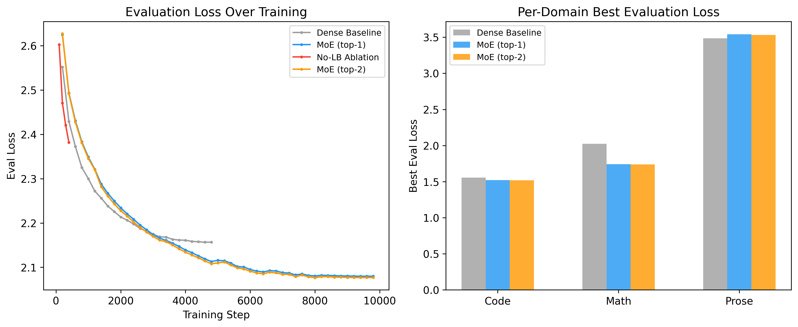
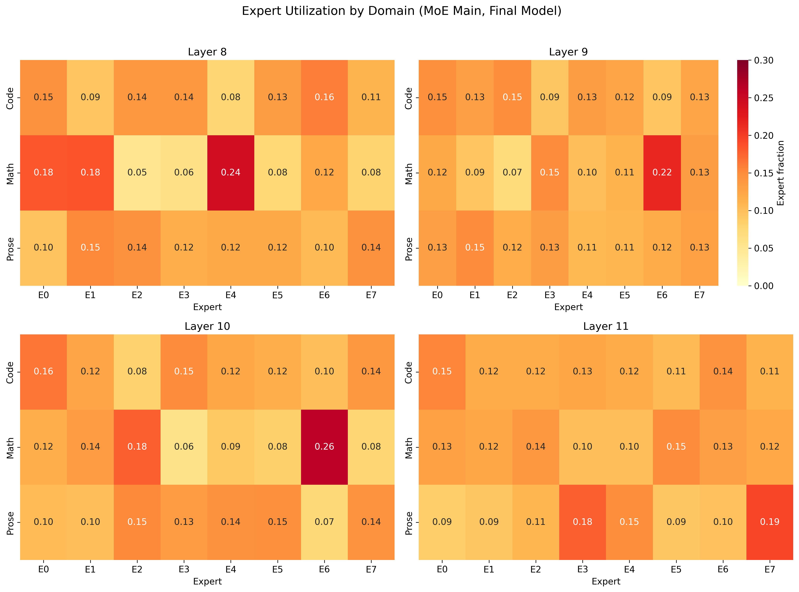
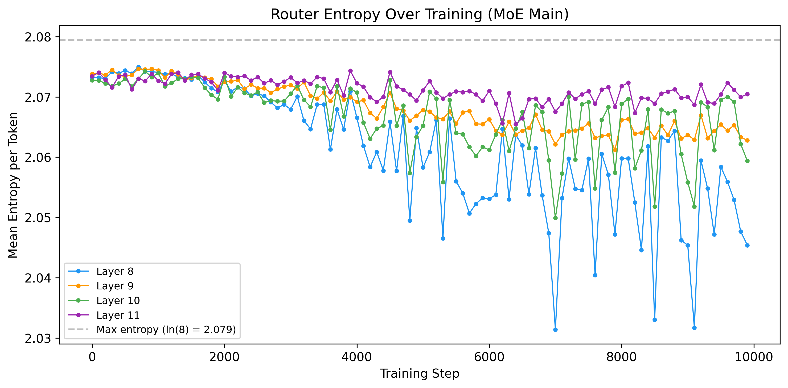
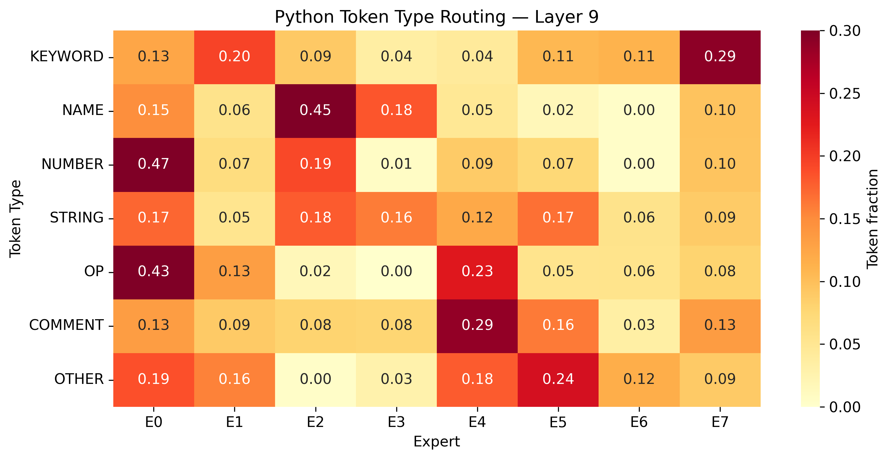
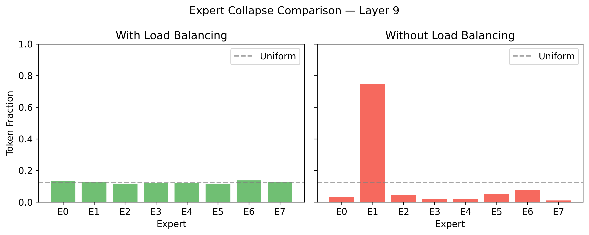

import Cite from "../../components/research/Cite.astro";
import Ref from "../../components/research/Ref.astro";

## TL;DR

I trained a GPT-2-based MoE model on three domains (code, math, prose) to see whether experts develop routing preferences. They do. The MoE model beats a dense baseline by 3.6% on aggregate eval loss, with math seeing the largest gain (14%) and prose the only regression (1.6%). Removing the load balancing loss causes full expert collapse within 500 training steps. Top-2 routing provides a negligible 0.14% improvement over top-1, confirming that a single active expert per token captures most of the benefit.

## 1. Motivation

Mixture-of-Experts (MoE) models route each token to a subset of "expert" feed-forward networks instead of passing everything through one shared FFN. Different experts learn different things, and the router learns which expert to call for which input. This goes back to <Cite id="jacobs1991" authors="Jacobs et al." year={1991} /> and has been scaled up in modern Transformers by <Cite id="shazeer2017" authors="Shazeer et al." year={2017} /> and <Cite id="fedus2022" authors="Fedus et al." year={2022} />.

I wanted to see this happen from scratch, at small scale, with interpretable domains. If I train a GPT-2-sized MoE on code, math, and prose, will the experts specialize by domain? Will expert 3 end up handling math while expert 7 handles code? Or will the routing stay diffuse?

This project is pedagogical, not competitive. The goal is a trained sparse Transformer with visualizations showing routing patterns, entropy curves, and expert affinity heatmaps. Not SOTA perplexity.

## 2. Architecture

### Base Model

I started from GPT-2 small <Cite id="radford2019" authors="Radford et al." year={2019} /> (124M parameters, 12 Transformer layers). The last 4 layers (8 through 11) have their feed-forward networks replaced with MoE layers, each containing 8 experts with top-1 routing. The earlier layers (0 through 7) stay dense because they handle general linguistic features that don't need domain-specific routing.

### MoE Layer Design

Each MoE layer replaces the original `MLP` block. I used a learned linear projection from the hidden dimension to the number of experts as the router:

```python
# router: [batch * seq_len, d_model] -> [batch * seq_len, n_experts]
router_logits = self.router(hidden_states)  # shape: [B*S, 8]
router_probs = F.softmax(router_logits, dim=-1)
topk_weights, topk_indices = torch.topk(router_probs, k=1, dim=-1)
```

For top-1 routing, each token is dispatched to exactly one expert. The forward pass uses the hard assignment (weight = 1.0), but gradients flow through the soft probability via a straight-through estimator <Cite id="bengio2013" authors="Bengio et al." year={2013} />. This lets the router learn from the loss signal even though the forward is discrete.

### Expert Initialization

I initialized each expert as a `deepcopy` of the original pretrained MLP, plus a small amount of Gaussian noise (`std=0.01`). The model begins training with 8 copies of a working FFN rather than 8 random networks, which avoids the cold-start problem of learning from scratch. The noise breaks symmetry so experts can diverge during training.

### Auxiliary Losses

Two auxiliary losses prevent degenerate routing:

1. **Load balancing loss** <Cite id="fedus2022" authors="Fedus et al." year={2022} />: penalizes uneven expert utilization. Defined as `n_experts * sum(f_i * P_i)` where `f_i` is the fraction of tokens routed to expert `i` and `P_i` is the mean router probability for expert `i`. The minimum value is 1.0 at perfect balance. Coefficient: `lb_coef = 0.01`.

2. **Z-loss** <Cite id="zoph2022" authors="Zoph et al." year={2022} />: stabilizes router logit magnitudes. Defined as `mean(logsumexp(router_logits)^2)`. Prevents the router from producing extremely confident (or noisy) predictions. Coefficient: `z_coef = 0.001`.

The total loss is: `LM_loss + lb_coef * LB_loss + z_coef * Z_loss`.


## 3. Training Setup

### Data

Three domains, each capped at 10MB of raw text:

| Domain | Source | Description |
|--------|--------|-------------|
| Code | CodeParrot-clean | Diverse Python files |
| Math | MathQA <Cite id="amini2019" authors="Amini et al." year={2019} /> | Problem + rationale pairs |
| Prose | C4 <Cite id="raffel2020" authors="Raffel et al." year={2020} /> | Filtered web text |

Texts are tokenized with the GPT-2 tokenizer, packed into 512-token blocks with domain labels, and token-balanced so each domain contributes equally to training batches. Without balancing, code produces 1.9x more tokens than prose, enough to bias expert routing toward code patterns.

After balancing: 4,296 blocks per domain, 12,888 total (~6.6M tokens). At 10,000 steps with an effective batch size of 8, the model sees ~6 epochs of the data.

### Runs

| Run | Mode | Steps | Key Change |
|-----|------|-------|------------|
| Dense baseline | Dense GPT-2 | 5,000 | No MoE layers |
| MoE main | Top-1, 8 experts | 10,000 | Primary experiment |
| No-LB ablation | Top-1, lb_coef=0 | 2,000 (early-stopped at 500) | Tests necessity of load balancing |
| Top-2 directional | Top-2, 8 experts | 10,000 | Tests whether a second expert helps |

All runs use `lr=5e-5`, cosine schedule, 10% warmup, `batch_size=2` with `grad_accum=4` (effective batch 8). All training ran on a single [PrimeIntellect](https://www.primeintellect.ai/) RTX 4090 24GB instance at $0.61/hr. Total GPU cost across all four runs, including setup and idle time: ~$2.79.


## 4. Results

### Dense vs MoE



| Metric | Dense | MoE (top-1) | Delta |
|--------|-------|-------------|-------|
| Eval loss | 2.157 | 2.080 | -3.6% |
| Code loss | 1.554 | 1.521 | -2.1% |
| Math loss | 2.023 | 1.740 | -14.0% |
| Prose loss | 3.485 | 3.541 | +1.6% |
| Perplexity | 8.64 | 7.91 | -8.4% |

The MoE model wins on aggregate loss by 3.6%. Math sees the largest improvement at 14% because its structured problem-rationale format gives experts something concrete to specialize on. Code improves modestly at 2.1%. Prose is the one domain where MoE loses: the dense model beats it by 1.6%.

C4 web text is heterogeneous: news, forums, recipes, product descriptions, everything. There's no single "prose pattern" for an expert to latch onto. Math and code have learnable structural regularities; prose, at this scale, does not.

> Note: These runs are not step-matched (5,000 dense vs 10,000 MoE), but the dense model had plateaued by step ~3,600, so additional steps would not have closed the gap.

### Training Dynamics

The MoE model crossed the dense baseline at step ~3,600 (36% of training). Both models plateaued around step 7,000-8,000, with the MoE eval loss settling at 2.080 and the dense at 2.157. The learning rate had decayed to near-zero by that point (cosine schedule), and the small dataset was fully memorized.

Load balance stayed healthy throughout the MoE main run: `lb_loss` started at 1.056 during warmup and settled to 1.011 by step 1,000, holding there for the remaining 9,000 steps. Z-loss converged from 4.3 at step 200 down to 0.99 by step 8,000, indicating the router logits stabilized completely.


## 5. Expert Specialization

### Domain-Level Routing

The central question: do the experts develop domain preferences?



Yes. The heatmaps show clear specialization patterns, especially in layers 8 and 10. In layer 10, expert 6 receives 0.260 of math tokens (vs the 0.125 uniform baseline), while getting only 0.075 of prose tokens. In layer 8, expert 4 gets 0.242 of math tokens but only 0.078 of code. Layer 8 shows some of the sharpest domain contrasts, while layer 11 stays more diffuse.

The routing is not perfectly disjoint (no expert handles only one domain), but the preferences are unambiguous. This is what you'd expect: the load balancing loss prevents full monopolization, so experts develop preferences rather than exclusive territories.

### Router Entropy



Router entropy starts near the maximum (`ln(8) = 2.079`, representing uniform routing) and decreases over training as the router learns to make sharper decisions, moving from "send tokens everywhere equally" to "send this token to expert 4 specifically." The decline is steepest in the first 2,000 steps and plateaus by step 5,000, mirroring the eval loss convergence.

Layers 9 and 10 show the lowest final entropy, meaning the router makes the sharpest per-token decisions in those layers. Layer 8 retains higher entropy: its router distributes probability more evenly across experts for any given token, even though the aggregate domain-level preferences are strong (as the heatmaps show). Per-token confidence and domain-level preference measure different things.

### Token-Level Routing

Beyond domain-level patterns, I analyzed how the router handles different Python token types within the code domain.



The router distinguishes between token types within the same domain. In layer 9, expert 0 handles 0.471 of NUMBER tokens and 0.429 of OP tokens, but only 0.125 of KEYWORDs. Expert 2 handles 0.447 of NAME tokens. The experts develop finer-grained preferences for syntactic roles, not just a coarse "this is code" distinction.

The analysis uses majority-vote mapping from BPE token spans to Python tokenizer categories, running 200 code samples through the final model and accumulating expert assignments per token type.


## 6. Ablations

### Without Load Balancing

The no-LB ablation removes the load balancing loss (`lb_coef = 0.0`) while keeping z-loss on (`z_coef = 0.001`). Is load balancing necessary, or will the router distribute tokens naturally?



Expert collapse happened fast. The first warning fired at step 100 (expert 5 in layer 11 handling 62.5% of tokens). By step 500, expert 1 in layer 9 had captured 73.6% of all tokens, triggering automatic early stopping.


The trajectory shows a classic collapse pattern: one expert begins with a slight advantage, the router reinforces that advantage by sending it more tokens, and the positive feedback loop accelerates until a single expert monopolizes the layer.

The no-LB model actually had *lower* LM loss than the MoE main run at step 400 (2.378 vs 2.493). Collapsing onto fewer experts can temporarily help optimization because the router doesn't need to learn distributed specialization. But this comes at the cost of dead experts and lost capacity.

Z-loss alone does not prevent collapse. It stabilizes the *magnitude* of router logits but has no mechanism to encourage balanced *distribution*. Of the two auxiliary losses, only lb_loss prevents collapse.

### Top-2 vs Top-1

The top-2 run routes each token to two experts with soft-weighted combination, doubling per-token expert compute. The main hypothesis: maybe two experts would help on prose, where top-1 routing struggles.

| Metric | Top-1 | Top-2 | Delta |
|--------|-------|-------|-------|
| Eval loss | 2.080 | 2.077 | -0.14% |
| Code loss | 1.521 | 1.518 | -0.19% |
| Math loss | 1.740 | 1.734 | -0.39% |
| Prose loss | 3.541 | 3.540 | -0.03% |
| lb_loss | 1.012 | 1.048 | +3.6% |

The improvement is 0.14%, consistent across 50 eval checkpoints but practically negligible. Math sees the largest (still tiny) gain at 0.39%. Prose barely moved at 0.03%.

This aligns with the Switch Transformer finding <Cite id="fedus2022" authors="Fedus et al." year={2022} />: top-1 routing captures most of the MoE benefit. The additional expert path adds compute without meaningfully improving expressiveness at this scale.

## 7. Limitations

**1.** GPT-2 small with 8 experts is far from production MoE systems like Mixtral <Cite id="jiang2024" authors="Jiang et al." year={2024} /> or Switch-C. Specialization patterns at this scale may not transfer to models with hundreds of experts.

**2.** Code, math, and prose are intentionally distinct. A harder test would be closely related domains (e.g., Python vs JavaScript, or algebra vs geometry) where the router needs to make finer distinctions.

**3.** C4 was the wrong dataset for demonstrating prose specialization. I chose it over WikiText-103 to avoid encyclopedic bias ([decision 010](https://github.com/sumitdotml/moe-emergence/blob/main/docs/decisions/010-dataset-choices.md)), but C4's topic distribution (47% general web content, 14.5% commerce, 12% tech, and dozens of smaller categories) is too diffuse for any expert to specialize on. This showed up immediately in training: prose loss barely moved after step 1,000 and the MoE model never caught the dense baseline on this domain. A narrower corpus with structural regularity (literary fiction, scientific abstracts, news articles) would have given the router patterns to exploit, the way MathQA's problem-rationale format did for math.

**4.** The dense baseline ran for 5,000 steps; MoE runs went to 10,000. The dense model had plateaued, but a perfectly controlled comparison would use identical step counts.

**5.** 10MB per domain, ~6 epochs of training. Larger datasets might reveal different specialization patterns or extend the region where MoE has an advantage.

**6.** Production MoE systems use a capacity factor to limit how many tokens each expert handles per batch, preventing overflow. I skipped this since the dataset is small enough that overflow wasn't a practical issue.

## 8. Conclusion

Expert specialization emerges reliably at small scale when the training data has domain structure. The MoE model's 14% improvement on math shows that structured, pattern-rich domains benefit most from expert routing. Prose -- heterogeneous web text with no dominant structure -- doesn't benefit, and actually regresses slightly.

The load balancing loss is essential. Without it, expert collapse happens within hundreds of steps, and z-loss alone doesn't help. Top-1 routing is sufficient: a second expert per token doubles the compute without moving the loss.

All training artifacts (checkpoints, metrics, W&B logs) and the analysis code are available in the [project repository](https://github.com/sumitdotml/moe-emergence). Models are on [HuggingFace](https://huggingface.co/sumitdotml/moe-emergence).


## References

<Ref id="jacobs1991"
  authors="Jacobs, R. A., Jordan, M. I., Nowlan, S. J., and Hinton, G. E."
  year={1991}
  title="Adaptive mixtures of local experts"
  venue="Neural Computation"
  volume="3(1)"
  pages="79-87"
  url="https://doi.org/10.1162/neco.1991.3.1.79" />

<Ref id="shazeer2017"
  authors="Shazeer, N., Mirhoseini, A., Maziarz, K., Davis, A., Le, Q., Hinton, G., and Dean, J."
  year={2017}
  title="Outrageously large neural networks: The sparsely-gated mixture-of-experts layer"
  arxiv="1701.06538" />

<Ref id="fedus2022"
  authors="Fedus, W., Zoph, B., and Shazeer, N."
  year={2022}
  title="Switch Transformers: Scaling to trillion parameter models with simple and efficient sparsity"
  venue="Journal of Machine Learning Research"
  volume="23(120)"
  pages="1-39"
  url="https://jmlr.org/papers/v23/21-0998.html" />

<Ref id="zoph2022"
  authors="Zoph, B., Bello, I., Kumar, S., Du, N., Huang, Y., Dean, J., Shazeer, N., and Fedus, W."
  year={2022}
  title="ST-MoE: Designing stable and transferable sparse expert models"
  arxiv="2202.08906" />

<Ref id="jiang2024"
  authors="Jiang, A. Q., Sablayrolles, A., Roux, A., Mensch, A., Savary, B., Bamford, C., Chaplot, D. S., de las Casas, D., Hanna, E. B., Bressand, F., Lenber, G., Bour, G., Lample, G., Lavaud, L. R., Saulnier, L., Lachaux, M.-A., Stock, P., Subramanian, S., Yang, S., Antoniak, S., Le Scao, T., Gerber, T., Vayer, T., Roux, T., Lavril, T., and El Sayed, W."
  year={2024}
  title="Mixtral of Experts"
  arxiv="2401.04088" />

<Ref id="radford2019"
  authors="Radford, A., Wu, J., Child, R., Luan, D., Amodei, D., and Sutskever, I."
  year={2019}
  title="Language models are unsupervised multitask learners"
  url="https://cdn.openai.com/better-language-models/language_models_are_unsupervised_multitask_learners.pdf" />

<Ref id="bengio2013"
  authors="Bengio, Y., Léonard, N., and Courville, A."
  year={2013}
  title="Estimating or propagating gradients through stochastic neurons for conditional computation"
  arxiv="1308.3432" />

<Ref id="amini2019"
  authors="Amini, A., Gabriel, S., Lin, P., Koncel-Kedziorski, R., Choi, Y., and Hajishirzi, H."
  year={2019}
  title="MathQA: Towards interpretable math word problem solving with operation-based formalisms"
  venue="NAACL"
  url="https://aclanthology.org/N19-1245/" />

<Ref id="raffel2020"
  authors="Raffel, C., Shazeer, N., Roberts, A., Lee, K., Narain, S., Matena, M., Zhou, Y., Li, W., and Liu, P. J."
  year={2020}
  title="Exploring the limits of transfer learning with a unified text-to-text transformer"
  venue="Journal of Machine Learning Research"
  volume="21(140)"
  pages="1-67"
  url="https://jmlr.org/papers/v21/20-074.html" />


## Appendix: Design Decisions

Three design choices shaped this project. Full decision records with alternatives considered are in the [project repository](https://github.com/sumitdotml/moe-emergence/tree/main/docs/decisions).

**GPT-2 as base model.** The goal is observing MoE routing behavior, not pushing performance. GPT-2 small is thoroughly documented, has stable HuggingFace integration, and fits within an $80 GPU budget. Its simplicity (no RoPE, no GQA, standard LayerNorm) means any observed effects can be attributed to the MoE routing rather than architectural quirks. More modern alternatives (Pythia-160M, custom Llama-style) were considered but added complexity without clear benefit for a pedagogical study.

**MoE in the last 4 layers.** Early Transformer layers tend to learn generic features (syntax, common patterns), while later layers learn more semantic, domain-specific features. Replacing all 12 layers with MoE would cost ~3x the compute and make it harder to interpret whether specialization reflects domain structure or just low-level token statistics. Layers 8-11 are where domain-specific routing is most meaningful, and the compute savings left budget for ablations.

**Warm-start via deepcopy.** Each expert starts as an exact copy of the pretrained MLP, plus tiny Gaussian noise (`std = param.std() * 1e-3`) for symmetry breaking. This means the model works identically at step 0 and experts diverge from a known baseline. Random initialization would break pretrained representations and confound "learning to specialize" with "learning to function at all." The noise scale matters: using `param.norm()` instead of `param.std()` would corrupt weights because the norm sums over millions of elements.

