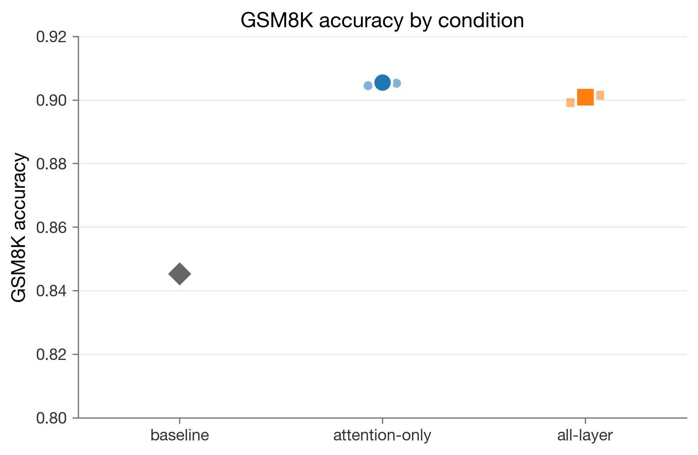
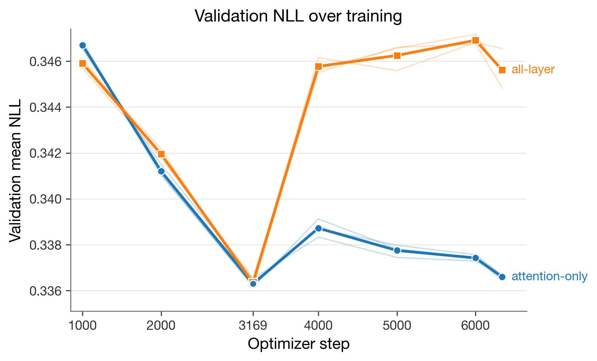
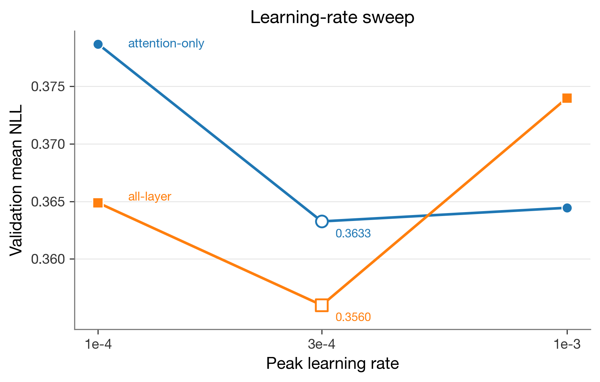

import Cite from "../../components/research/Cite.astro";
import Ref from "../../components/research/Ref.astro";

## TL;DR

This experiment fine-tuned `Qwen3-8B` <Cite id="qwen3" authors="Yang et al." year={2025} /> on a math SFT dataset derived from `nvidia/OpenMathInstruct-2` <Cite id="openmathinstruct2" authors="Toshniwal et al." year={2024} /> and compared two LoRA <Cite id="lora" authors="Hu et al." year={2021} /> adapter scopes on GSM8K <Cite id="gsm8k" authors="Cobbe et al." year={2021} />. Attention-only LoRA reached mean GSM8K accuracy `0.9055` across `N=3` seeds, while all-layer LoRA reached `0.9009`. The `0.455` percentage-point gap favors attention-only in this run set, but it is below the frozen `0.01` accuracy threshold for a winner claim that I had set in advance. I read this as a local result rather than a general rule, and as motivation for studying when narrower adapters are enough versus when broader adaptation is worth the extra size.

**Published artifacts.**

| Artifact                             | Location                                                                                               |
| ------------------------------------ | ------------------------------------------------------------------------------------------------------ |
| Experiment code and source artifacts | [GitHub repository](https://github.com/sumitdotml/lora-and-friends)                                    |
| Six selected LoRA adapter exports    | [HuggingFace model repo](https://huggingface.co/sumitdotml/lora-and-friends)                           |
| Frozen raw and rendered SFT dataset  | [HuggingFace dataset repo](https://huggingface.co/datasets/sumitdotml/lora-and-friends-dataset)        |
| Third-party notices                  | [GitHub notices file](https://github.com/sumitdotml/lora-and-friends/blob/main/THIRD_PARTY_NOTICES.md) |

## 1. Motivation

LoRA adapts a frozen model by training low-rank updates rather than updating the full parameter set. The method is often treated as a single straightforward switch: you choose a rank, then a learning rate, and then decide which modules receive adapters. I did this study to isolate the last choice under one narrow setup.

This study was also motivated by Thinking Machines Lab's _LoRA Without Regret_ <Cite id="lora-without-regret" authors="Schulman and Thinking Machines Lab" year={2025} />, especially its discussion of where LoRA is applied and when broader adaptation may be worth the extra capacity.

The practical question was whether adding MLP adapters helps a small math SFT run on `Qwen3-8B`, or whether attention-only adapters are enough. I intentionally kept the scope small: one base model, one dataset recipe, one benchmark, rank `8`, and three seeds per LoRA condition.

## 2. Experimental Question

The comparison was:

- `attention_only`: train adapters for `q_proj`, `k_proj`, `v_proj`, and `o_proj`.
- `all_layer`: train those attention adapters plus `gate_proj`, `up_proj`, and `down_proj`.

Both conditions used the same rendered dataset, base model, rank, selected peak learning rate, training schedule, checkpoint-selection rule, and GSM8K eval contract so that I could draw comparisons in the most unbiased way possible. The intended variable was adapter scope.

The frozen interpretation rule bounds how that mean gap can be read. A condition mean gap below `0.01` accuracy was to be reported as inconclusive rather than as a winner.

## 3. Dataset And Evaluation Contract

### 3.1 Dataset curation

The retained raw dataset is `openmath_original_clean`, built from the `train_1M` split of `nvidia/OpenMathInstruct-2`. It is the second candidate the project produced. An earlier candidate, `openmath_30k`, drew heavily on the augmented sources of the same split to hit a balanced 30,000-row target. Manual review packs on that candidate kept surfacing the same family of defects in the augmented rows, including impossible integer counts in physical settings, prompt-generation residue such as the literal string `A new problem:`, and chains of reasoning that silently restated the problem to match the boxed answer. After my repeated repair passes did not bring the rejection rate to zero, I decided to drop the augmented branch as I concluded that it was noisy & unreliable and thus rebuilt the dataset again from original-source rows only.

The retained build keeps rows from the `gsm8k` and `math` sources of `train_1M`. The strict acceptance gate considered `14,764` `gsm8k` candidates and `14,704` `math` candidates, for `29,468` original-source candidate rows. It accepted `14,618` `gsm8k` rows and `13,548` `math` rows, for `28,166` accepted rows. The retained reject reasons in the dataset manifest are `1,205` boxed-answer mismatches and `97` suspicious patterns across the two sources. After the [train/validation split repair](#32-trainvalidation-split-rule), the final raw split has `25,348` train rows and `2,818` validation rows.

Automated checks on the retained build returned a boxed-match rate of `1.0` on both splits, no remaining suspicious rows, and no prompt-wrapper contamination hits. The same retained dataset is the input to every result in [Results](#5-results) and every diagnostic in [Diagnostics](#6-diagnostics).

### 3.2 Train/validation split rule

`OpenMathInstruct-2` can include multiple accepted solutions for the same underlying problem. A row-level random split therefore tends to place answer-variants of the same problem in both train and validation, which inflates validation likelihood and weakens the checkpoint-selection signal. The retained build groups rows by canonical problem text before assigning them to a split, so all variants of a given problem land on the same side.

After the regrouping, the contamination report recorded `row_id_overlap_count = 0` and `problem_text_overlap_count = 0` between train and validation. The benchmark gate from [Contamination and overlap gates](#34-contamination-and-overlap-gates) was applied to the same retained split.

### 3.3 Rendered training contract

The rendered training dataset uses the `Qwen/Qwen3-8B` chat template with `enable_thinking=False` and the fixed system prompt:

```text
You are a careful math solver. Solve the problem step by step. Put the final answer in \boxed{}.
```

The system prompt was kept because raw `OpenMathInstruct-2` problems do not always carry the boxed-answer instruction, and because the same prompt is required by the [GSM8K evaluation contract](#35-gsm8k-evaluation-contract). On a `500`-row tokenizer sample, the prompt added a constant `27` rendered tokens per example, which was small enough not to reshape the budget.

### 3.4 Contamination and overlap gates

The retained contamination report passed two gates:

| Check                                                     | Result |
| --------------------------------------------------------- | -----: |
| GSM8K test overlap against training-side `gsm8k` problems |    `0` |
| Train/validation row-id overlap                           |    `0` |
| Train/validation problem-text overlap                     |    `0` |

The GSM8K overlap check used the `openai/gsm8k` `main` test split and compared the training-side `problem` field for rows where `source == "gsm8k"`, after Unicode-NFKC, lowercase, and whitespace-collapsed normalization. A non-zero result on either gate was treated as blocking under the failure rule in the frozen evaluation contract; both gates had to pass before any benchmark run.

### 3.5 GSM8K evaluation contract

GSM8K evaluation used the `1,319`-example test split. Decoding was greedy with temperature `0`, `max_new_tokens=512`, no fallback answer extractor, and exact match after boxed-answer extraction and normalization. If a model did not emit a parseable boxed answer, the example was scored incorrect.

## 4. Training Setup

### 4.1 Base model and render alignment

The base model I decided to go with was `Qwen/Qwen3-8B`. Qwen3 supports both thinking and non-thinking modes in its chat template; however, I decided to disable thinking mode for the rendered SFT dataset and for evaluation so the training and evaluation would be consistent with matching contracts.

The training-side render came from `AutoTokenizer.apply_chat_template(..., enable_thinking=False)` applied to each message list, which emits an empty `<think>\n\n</think>` block before the assistant answer. The Tinker cookbook `qwen3_disable_thinking` renderer was correct for generation prompts but did not reproduce that SFT render along the supervised-training path. The runner therefore builds Tinker training datums directly from the HuggingFace chat template and masks the loss to the assistant-answer tokens after the rendered prompt prefix. With this correction, the training render and the GSM8K evaluation render produce the same prompt structure.

### 4.2 Adapter and optimizer defaults

Both LoRA conditions used Tinker with rank `r=8`, `train_unembed=false`, and peak learning rate `3e-4`. Tinker `0.18.2` did not expose local `lora_alpha` or `lora_dropout` fields through this training path. The PEFT adapter configs now published on HuggingFace record the exported adapter values as `lora_alpha=32` and `lora_dropout=0`, so I will assume that those were being applied through the Tinker API's backend. Additionally, the Adam internals (`beta1=0.9`, `beta2=0.95`, `eps=1e-12`, `weight_decay=0`, `grad_clip_norm=0`) are inherited from the Tinker `0.18.2` `AdamParams` defaults and are not tuned in this study.

### 4.3 LR selection

The small LR-selection run used seed `7`, `512` train rows, `128` validation rows, and the grid `1e-4`, `3e-4`, `1e-3`. Both conditions selected `3e-4` by minimum validation mean negative log-likelihood (NLL). Seed `7` was reserved for selection work so the main comparison seeds could be `0`, `1`, and `2`.

### 4.4 Main run schedule

Main training used seeds `0`, `1`, and `2` for each condition:

| Setting              | Value                                                          |
| -------------------- | -------------------------------------------------------------- |
| Train rows           | `25,348`                                                       |
| Validation rows      | `2,818`                                                        |
| Epochs               | `2`                                                            |
| Effective batch size | `8`                                                            |
| Optimizer steps      | `6,338`                                                        |
| Request shape        | `batched_datums_pipelined`                                     |
| Warmup steps         | `190`                                                          |
| Schedule             | linear warmup, cosine decay                                    |
| Min LR               | `3e-5`                                                         |
| Checkpoint rule      | lowest validation mean NLL; exact ties choose later checkpoint |

Every main run selected the step-`3169` checkpoint by validation NLL, which was the end of the first epoch and not the final training step.

### 4.5 Checkpoint export

Selected training checkpoints were written under Tinker's training namespace as `weights/<run-id>-step-3169`. Before any GSM8K evaluation or HuggingFace upload, each selected checkpoint was loaded via `load_state_async(...)` and re-emitted via `save_weights_for_sampler_async(...)` to produce a sampler-format weight set as the sampler form was required by the evaluation sampling client. The six adapters published in the [HuggingFace model repo](https://huggingface.co/sumitdotml/lora-and-friends) are these sampler-converted exports, and the GSM8K numbers in [Results](#5-results) were measured against them rather than against training-state weights.

## 5. Results

**Figure 1. Primary GSM8K comparison.**

| condition      | target_modules                                                | adapter_size_mb | seeds | mean_accuracy | min_accuracy | max_accuracy | delta_vs_baseline_pp | extraction_failures | eval_tokens |
| -------------- | ------------------------------------------------------------- | --------------: | ----: | ------------: | -----------: | -----------: | -------------------: | ------------------: | ----------: |
| baseline       | n/a                                                           |             n/a |     1 |        0.8453 |       0.8453 |       0.8453 |               +0.000 |                  31 |      505694 |
| attention_only | q_proj, k_proj, v_proj, o_proj                                |            29.4 |     3 |        0.9055 |       0.9045 |       0.9067 |               +6.015 |                  13 |     1077382 |
| all_layer      | q_proj, k_proj, v_proj, o_proj, gate_proj, up_proj, down_proj |            83.5 |     3 |        0.9009 |       0.8992 |       0.9022 |               +5.560 |                  17 |     1069860 |

The untouched baseline scored `1115/1319`, or `0.8453373768006065`. Attention-only LoRA scored `1193/1319`, `1196/1319`, and `1194/1319` across seeds `0`, `1`, and `2` respectively. Meanwhile, all-layer LoRA scored `1186/1319`, `1190/1319`, and `1189/1319` across the respective seeds.



_Figure 2. GSM8K accuracy by condition on the 1,319-example test set. The large markers show condition means; small markers show individual seeds. No statistical confidence interval is shown._

The attention-only range, `0.9045` to `0.9067`, sits above the all-layer range, `0.8992` to `0.9022`, in this retained run set. This non-overlap is descriptive evidence and does not remove the `N=3` limitation or the frozen inconclusive-band rule.

## 6. Diagnostics

Validation NLL and GSM8K accuracy did not measure the same thing; validation NLL selected checkpoints from the SFT validation set, while GSM8K accuracy measured exact boxed-answer correctness on a held-out benchmark.



_Figure 3. Validation negative log-likelihood (NLL) over training. Both conditions selected step `3169`; attention-only had mean validation NLL `0.336295` at that step, and all-layer had `0.336339`._

All six main runs selected the step-`3169` checkpoint under the lowest-mean-validation-NLL rule. Step `3169` is the end of the first epoch under the frozen schedule. The per-seed selected NLLs were `0.336164`, `0.336212`, and `0.336510` for `attention_only` seeds `0`, `1`, and `2`, and `0.336119`, `0.336556`, and `0.336341` for `all_layer` seeds `0`, `1`, and `2`.

After step `3169`, attention-only validation NLL stayed close to its minimum, while all-layer validation NLL rose more sharply. At step `4000`, the attention-only condition mean was `0.338719`, while the all-layer condition mean was `0.345773`. That divergence is consistent with the higher-capacity adapter overfitting faster on this dataset size, but this experiment treats it as a diagnostic shape rather than as proof of a mechanism.



_Figure 4. LR-selection validation NLL on the small slice. Both conditions selected `3e-4`; attention-only was flatter between `3e-4` and `1e-3`, while all-layer rose more at `1e-3`._

The LR-selection sweep that was conducted before the main training run also hinted that the higher-capacity adapter was more sensitive to LR in this small slice. Attention-only moved from `0.3632619345728878` at `3e-4` to `0.3644437038722405` at `1e-3`. All-layer moved from `0.3559855057286731` at `3e-4` to `0.37397296784836664` at `1e-3`.


_Figure 5. Per-seed disagreement on GSM8K. Each panel counts examples where attention-only is correct and all-layer is wrong, and the reverse._

The disagreement view shows that the mean gap did not come from one seed alone. Attention-only won more one-sided disagreements in each paired seed: `+7`, `+6`, and `+5` examples for seeds `0`, `1`, and `2`.

## 7. Cost And Operational Notes

**Figure 6. Token and adapter-size accounting.**

| condition      | adapter_size_mb | train_tokens_per_run | validation_tokens_per_run | eval_tokens_per_run | mean_accuracy | extraction_failures |
| -------------- | --------------: | -------------------: | ------------------------: | ------------------: | ------------: | ------------------: |
| baseline       |             n/a |                  n/a |                       n/a |             505,694 |        0.8453 |                  31 |
| attention_only |            29.4 |           17,227,430 |                 6,556,081 |             359,127 |        0.9055 |                  13 |
| all_layer      |            83.5 |           17,227,430 |                 6,556,081 |             356,620 |        0.9009 |                  17 |

The training-side token counts were identical across conditions because the dataset and schedule were fixed. The `adapter_size_mb` values are retained rounded reporting values. On the HuggingFace model repo main branch, the attention-only `adapter_model.safetensors` files are `30,709,160` bytes each, and the all-layer files are `87,360,552` bytes each.

I had also conducted a throughput probe experiment, which can be further explored in [Appendix C](#c-throughput-probe). This provides operational context and explains why the main run used `batched_datums_pipelined`, while keeping the same nominal effective batch size of `8`. It does not indicate a model-quality result.

## 8. Limitations

This is a scoped empirical case study and not a broad LoRA target-module law. Below, as per my understanding of the project, are some of this experiment's limitations:

- GSM8K is a single benchmark. It is useful for grade-school math word problems, but it does not cover all math reasoning behavior.
- Each LoRA condition has only `N=3` seeds. The observed ranges do not overlap, but that does not support a statistical significance claim here.
- The setup uses one base model, one dataset recipe, one rank, one backend training path, and one selected LR per condition. Different ranks, datasets, optimizers, models, or answer-extraction contracts could change the result.
- Tinker owned some backend LoRA details during training. The local runner controlled rank and layer-family switches, but it did not set `lora_alpha` or `lora_dropout`; those values are visible only in the exported adapter configs.
- The exported HuggingFace adapter configs use PEFT's saved config format. The public directories are organized by the experimental conditions used in this study, while the exported config files themselves use PEFT's generic `target_modules` representation.

## 9. Reproducibility

A companion worklog gives the longer story behind this report, including the early false starts, dataset cleanup, training runs, evaluation, and figures: [LoRA Target-Module Worklog](/blog/lora-target-module-worklog).

The public HuggingFace artifacts are:

| Purpose                         | URL                                                                                             |
| ------------------------------- | ----------------------------------------------------------------------------------------------- |
| Selected LoRA adapter exports   | [HuggingFace model repo](https://huggingface.co/sumitdotml/lora-and-friends)                    |
| Frozen raw and rendered dataset | [HuggingFace dataset repo](https://huggingface.co/datasets/sumitdotml/lora-and-friends-dataset) |

The experiment code and retained source-of-truth artifacts live in the project's [GitHub repository](https://github.com/sumitdotml/lora-and-friends). Third-party dataset, model, and backend notices are tracked in the repository's [third-party notices file](https://github.com/sumitdotml/lora-and-friends/blob/main/THIRD_PARTY_NOTICES.md):

| Purpose                                                                                                                  | URL                                                                                                                                                                                                                  |
| ------------------------------------------------------------------------------------------------------------------------ | -------------------------------------------------------------------------------------------------------------------------------------------------------------------------------------------------------------------- |
| Baseline GSM8K result                                                                                                    | [`artifacts/results/baseline-qwen3-8b-gsm8k-001/summary.json`](https://github.com/sumitdotml/lora-and-friends/blob/main/artifacts/results/baseline-qwen3-8b-gsm8k-001/summary.json)                                  |
| Main training runs (six `main-001-<condition>-seed-<seed>/` directories)                                                 | [`artifacts/results/`](https://github.com/sumitdotml/lora-and-friends/tree/main/artifacts/results)                                                                                                                   |
| Selected-checkpoint GSM8K evals (six `checkpoint-...-gsm8k-...` directories) | [`artifacts/results/`](https://github.com/sumitdotml/lora-and-friends/tree/main/artifacts/results)                                                                                                                   |
| Dataset manifest                                                                                                         | [`artifacts/raw_datasets/openmath_original_clean/manifest.json`](https://github.com/sumitdotml/lora-and-friends/blob/main/artifacts/raw_datasets/openmath_original_clean/manifest.json)                              |
| Rendered dataset directory                                                                                               | [`artifacts/rendered_datasets/openmath_original_clean_qwen3_disable_thinking/`](https://github.com/sumitdotml/lora-and-friends/tree/main/artifacts/rendered_datasets/openmath_original_clean_qwen3_disable_thinking) |
| Contamination report                                                                                                     | [`artifacts/audits/contamination_check/report.json`](https://github.com/sumitdotml/lora-and-friends/blob/main/artifacts/audits/contamination_check/report.json)                                                      |
| Frozen eval contract                                                                                                     | [`docs/freeze/eval_contract.md`](https://github.com/sumitdotml/lora-and-friends/blob/main/docs/freeze/eval_contract.md)                                                                                              |
| Frozen LoRA defaults                                                                                                     | [`docs/freeze/lora_defaults.md`](https://github.com/sumitdotml/lora-and-friends/blob/main/docs/freeze/lora_defaults.md)                                                                                              |
| Frozen run protocol                                                                                                      | [`docs/freeze/run_protocol.md`](https://github.com/sumitdotml/lora-and-friends/blob/main/docs/freeze/run_protocol.md)                                                                                                |
| Figure provenance (`fig_*/fig_*.provenance.json` under each figure directory)                                            | [`artifacts/figures/`](https://github.com/sumitdotml/lora-and-friends/tree/main/artifacts/figures)                                                                                                                   |
| Main training script                                                                                                     | [`training/run_main_training.py`](https://github.com/sumitdotml/lora-and-friends/blob/main/training/run_main_training.py)                                                                                            |

The HuggingFace model repo main branch contains six selected adapter exports under `checkpoints/best-checkpoints/`, split by condition, seed, and step. The HuggingFace dataset repo contains both the raw rows and the rendered `Qwen3-8B` chat-template rows used for training.

The retained main-run command is:

```bash
uv run training/run_main_training.py --run-prefix main-001
```

The frozen protocol expanded that command across two conditions and three seeds. The final comparison did not pick the best seed. It evaluated each selected checkpoint on GSM8K and reduced each condition by the mean across the three seeds.

## 10. Conclusion

Under this exact `Qwen3-8B` math SFT setup, attention-only LoRA produced the higher GSM8K mean and won more paired disagreements at every seed. The gap was small, `0.455` percentage points, and stayed below the prewritten `0.01` winner threshold.

Therefore, I would keep the conclusion local to this experiment. Attention-only LoRA was smaller and slightly ahead here, but that does not mean it will always be the best option. The answer likely changes with the model, the data, and what the fine-tune is meant to improve. This points to a useful follow-up question: when are narrow adapters enough, and when is broader adaptation worth the extra size? I naturally see this as a promising research direction beyond the scope of this first experiment.

## Acknowledgments

I thank Thinking Machines Lab for providing Tinker credits that supported the training and evaluation runs in this experiment.

## References

<Ref id="lora"
  authors="Hu, E. J., Shen, Y., Wallis, P., Allen-Zhu, Z., Li, Y., Wang, S., Wang, L., and Chen, W."
  year={2021}
  title="LoRA: Low-Rank Adaptation of Large Language Models"
  url="https://arxiv.org/abs/2106.09685"
  arxiv="2106.09685" />

<Ref id="gsm8k"
  authors="Cobbe, K., Kosaraju, V., Bavarian, M., Chen, M., Jun, H., Kaiser, L., Plappert, M., Tworek, J., Hilton, J., Nakano, R., Hesse, C., and Schulman, J."
  year={2021}
  title="Training Verifiers to Solve Math Word Problems"
  url="https://arxiv.org/abs/2110.14168"
  arxiv="2110.14168" />

<Ref id="qwen3"
  authors="Yang, A., Li, A., Yang, B., Zhang, B., Hui, B., Zheng, B., Yu, B., Gao, C., Huang, C., Lv, C., and others"
  year={2025}
  title="Qwen3 Technical Report"
  url="https://arxiv.org/abs/2505.09388"
  arxiv="2505.09388" />

<Ref id="openmathinstruct2"
  authors="Toshniwal, S., Du, W., Moshkov, I., Kisacanin, B., Ayrapetyan, A., and Gitman, I."
  year={2024}
  title="OpenMathInstruct-2: Accelerating AI for Math with Massive Open-Source Instruction Data"
  url="https://arxiv.org/abs/2410.01560"
  arxiv="2410.01560" />

<Ref id="lora-without-regret"
  authors="Schulman, J., and Thinking Machines Lab"
  year={2025}
  title="LoRA Without Regret"
  venue="Thinking Machines Lab Blog"
  url="https://thinkingmachines.ai/blog/lora/" />

## Appendix

### A. Full Disagreement Table

| Seed | Attn correct, All-layer wrong | All-layer correct, Attn wrong | Delta (Attn - All) | Both correct | Both wrong |
| ---: | ----------------------------: | ----------------------------: | -----------------: | -----------: | ---------: |
|    0 |                            54 |                            47 |                 +7 |         1139 |         79 |
|    1 |                            49 |                            43 |                 +6 |         1147 |         80 |
|    2 |                            46 |                            41 |                 +5 |         1148 |         84 |

Each row sums to `1,319` examples.

### B. Disagreement Examples

| Seed | Direction              | Benchmark index | Reference | Attention-only extracted answer | All-layer extracted answer |
| ---: | ---------------------- | --------------: | --------: | ------------------------------: | -------------------------: |
|    0 | attention-only correct |              18 |         7 |                               7 |                         21 |
|    0 | all-layer correct      |               2 |     70000 |                          195000 |                      70000 |
|    1 | attention-only correct |              13 |        18 |                              18 |                         15 |
|    1 | all-layer correct      |              39 |        18 |                              48 |                         18 |
|    2 | attention-only correct |               5 |        64 |                              64 |                         50 |
|    2 | all-layer correct      |              40 |         8 |                              12 |                          8 |

The lowest-index seed-0 attention-only example asks how many dozens of eggs Claire eats after making a three-egg omelet every morning for four weeks. Attention-only computes `84 / 12 = 7`; all-layer mistakenly treats `84` as omelets and multiplies by `3` again.

The lowest-index seed-2 all-layer example asks for Brandon's iPhone age given Suzy's one-year phone, Ben's phone at two times Suzy's age, and Brandon's at four times Ben's age. All-layer extracts `8`; attention-only interprets "two times older" as adding two extra years and extracts `12`.

### C. Throughput Probe


_Figure 7. Throughput probe for attention-only LoRA at effective batch size `8`. Pipelined batching reduced mean step time from `20.2` seconds to `2.4` seconds in the retained probe._

The retained probe measured `20.22187466151081` seconds per optimizer step for sequential single-datum calls, `5.201307859155349` seconds for batched datums, and `2.4104866901249693` seconds for batched pipelined datums.

### D. Source Map Notes

The public numbers in this article were checked against retained artifacts during drafting. Each source below resolves under the project repository at [github.com/sumitdotml/lora-and-friends](https://github.com/sumitdotml/lora-and-friends) or the linked HuggingFace repo:

| Claim family                                            | Source                                                                                                                                                                                                               |
| ------------------------------------------------------- | -------------------------------------------------------------------------------------------------------------------------------------------------------------------------------------------------------------------- |
| Baseline accuracy, extraction failures, and eval tokens | [`artifacts/results/baseline-qwen3-8b-gsm8k-001/`](https://github.com/sumitdotml/lora-and-friends/tree/main/artifacts/results/baseline-qwen3-8b-gsm8k-001) (`summary.json` and `metrics.jsonl`)                      |
| Per-seed LoRA GSM8K accuracies                          | Six `checkpoint-...-gsm8k-...` directories under [`artifacts/results/`](https://github.com/sumitdotml/lora-and-friends/tree/main/artifacts/results)                                                                  |
| Training validation NLL and selected step               | Six `main-001-<condition>-seed-<seed>/` directories under [`artifacts/results/`](https://github.com/sumitdotml/lora-and-friends/tree/main/artifacts/results)                                                         |
| Dataset rows, split rule, source counts                 | [`artifacts/raw_datasets/openmath_original_clean/manifest.json`](https://github.com/sumitdotml/lora-and-friends/blob/main/artifacts/raw_datasets/openmath_original_clean/manifest.json)                              |
| Rendered dataset rows and system prompt                 | [`artifacts/rendered_datasets/openmath_original_clean_qwen3_disable_thinking/`](https://github.com/sumitdotml/lora-and-friends/tree/main/artifacts/rendered_datasets/openmath_original_clean_qwen3_disable_thinking) |
| Contamination and train/val overlap gates               | [`artifacts/audits/contamination_check/report.json`](https://github.com/sumitdotml/lora-and-friends/blob/main/artifacts/audits/contamination_check/report.json)                                                      |
| LR selection, run protocol, null-result rule            | [`docs/freeze/run_protocol.md`](https://github.com/sumitdotml/lora-and-friends/blob/main/docs/freeze/run_protocol.md)                                                                                                |
| Target modules and backend-owned LoRA fields            | [`docs/freeze/lora_defaults.md`](https://github.com/sumitdotml/lora-and-friends/blob/main/docs/freeze/lora_defaults.md)                                                                                              |
| Figure captions and derived tables                      | Per-figure subdirectories under [`artifacts/figures/`](https://github.com/sumitdotml/lora-and-friends/tree/main/artifacts/figures) (`fig_*.md` and `fig_*.data.csv`)                                                 |
| Public adapter files and model-card README              | [HuggingFace model repo](https://huggingface.co/sumitdotml/lora-and-friends)                                                                                                                                         |
| Public dataset files and dataset-card README            | [HuggingFace dataset repo](https://huggingface.co/datasets/sumitdotml/lora-and-friends-dataset)                                                                                                                      |
