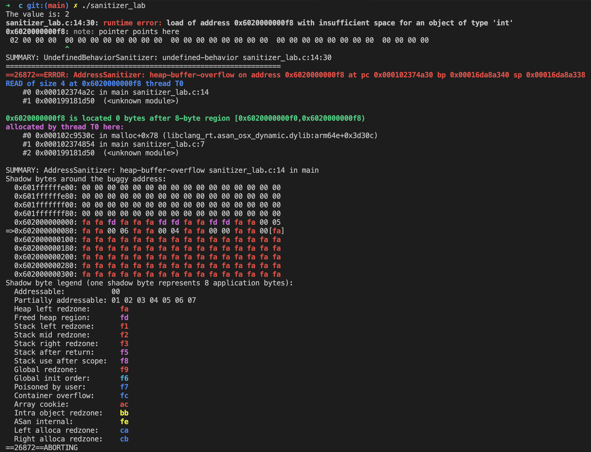

I made it my mission to seriously pursue my CUDA journey from this week. As this was week 0 where 
I had to figure some stuff about where exactly I needed to begin with, the issue that I had while 
reading the [PMPP book](https://www.amazon.co.jp/Wen-mei-W-Hwu-ebook/dp/B0DRCSRMXC) came to my 
mind: I sucked at C. Too much .py, .ts & .tsx in my life. I knew a bit about pointers before, but 
I realized I had all but dumped it down the drain.

I'm not a big fan of roadmaps, but I had to at least ensure I did not drift away into irrelevant 
stuff. So I asked a couple of experts who're well-versed with GPU stuff, and prepared a 
high level roadmap for myself to loosely follow over the span of the next 7-8 months.

In which C is the first step. I've decided to firstly get a good enough base in C before 
continuing chapter 3 of the PMPP book, hopefully to be done within a month. And here I am.

## This Week: C Tooling Basics

I knew how to do some `gcc abc.cpp -o abc`, but I needed to get a hold of some compiler flags for 
tooling + debugging.

Some flags that I've decided I'll use regularly are:

### Strict mode by default

```zsh
cc -std=c11 -Wall -Wextra -Werror hello.c -o hello
```

`-std=c11` -> compile using the C11 language standard, keeps the language mode explicit

`-Wall` -> enable many common warnings

`-Wextra` ->  Enable extra warnings beyond `-Wall`, useful for stricter learning builds

`-Werror` -> Treat warnings as errors since failed builds can leave an older executable in place

### Basic debugging

```zsh
cc -std=c11 -Wall -Wextra -Werror -g -O0 hello.c -o hello_debug
```

`-g` -> adds debug information for tools like `lldb`. usually does not change normal program output

`-O0` -> disables optimizations. good for debugging as it keeps generated code closer to the source

### Measuring performance

```zsh
cc -std=c11 -Wall -Wextra -Werror -O2 hello.c -o hello_performance
```

`-O2` -> moderates optimization. same visible output for `hello.c`; used for release/performance 
builds and not debugging

### Memory errors or undefined behaviors



```zsh
cc -std=c11 -Wall -Wextra -Werror -g -O1 -fsanitize=address,undefined -fno-omit-frame-pointer hello.c -o hello_sanitizer
```

`-fsanitize=address` -> adds runtime checks for many memory errors. catches stack overflow, heap 
overflow, use-after-free, and double-free

`-fsanitize=undefined` -> adds runtime checks for many undefined behaviors

`-fno-omit-frame-pointer` -> preserves frame pointers for clearer stack traces. used in sanitizer 
builds so reports can show useful call stacks

## Next Week

- Start memory, pointers, and flat arrays in C. I've dedicated 2-3 weeks to get comfortable with 
these, but I need to work faster.
- Read a couple of technical reports on model releases.
